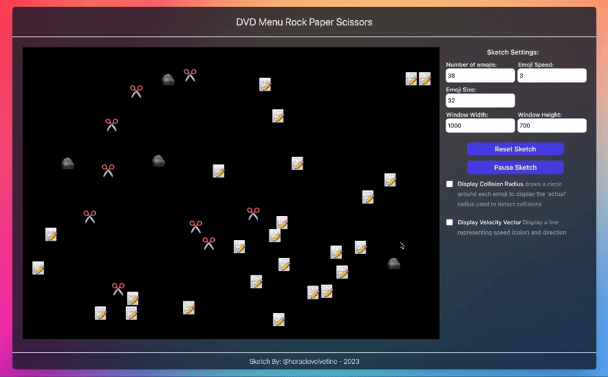

# Summary


A sketch using p5.js creating a simple collision detection with a Rock, Paper Scissors twist. This idea is based off of a random GIF I saw once - I couldn't find that source info - but if you know let me know! [Contact-Me](mailto:horaciovelvetine@gmail.com)

## Getting Started

To run this project locally, clone the repository and run: This should deploy a local server at port [3000](http://localhost:3000/) where you can mess with things as you like.

```
npm install
npm run dev
```

## npm scripts

- `npm run dev` - Starts the development server at port [3000](http://localhost:3000/)
- `npm run build` - Builds the application in a `dist` folder
- `npm run preview` - Serves the build files (`dist` folder) locally at port [5000](http://localhost:3000/)

Note that if after this last command you do not see anything, you can use instead this other command:

- `npm run preview --host` - You should then be able to see your files locally at port [5000](http://localhost:3000/)

### Development

- There are a series of values needed to calculate the onScreen elements, these 'settings' are stored as values inside of the index.html file. This means theres only 1 originating source for these values, this is intentional. They are accessed through the p5.js wrapper inside of the [Sketch Manager]('/src/models/sketch_manager.js').

- Given the current update lifecycle of each [Collision Entitiy]('/src/models/collision_entity.js') the buffer is set to a value of N, then immediately reduced by 1 (to N-1) making the entity available for collision sooner than 'intended'. At the same time at the end of the update cycle the buffer is extended by 1 in the remaining assignment of ent.lastCollidedEnt still being 'truthy' waiting for the buffer to be 0 before being nulled. I'm not sure if this is having any un-intended consequences/side-effects, but it seems to be working as intended.

- The starting position of each emoji is randomly calculated based on the screen size, this occasionally leads to Emoji's starting on top/inside of one another and 'clumping'. This behavior is not intended, and leads to the ent's bouncing off of each other continuously, almost like an orbit. While this happens occasionally by chance on startup, it also can happen with the wrong mix of emoji speed, size, and screen size. There are some corrective de-clumping measures in place, but they are not covering every collision scenario. This is a known issue...

#### Sources

- [p5.js](https://p5js.org/) && [pg.js's github](https://github.com/processing/p5.js)
- [Circle Collision Example](https://p5js.org/examples/motion-circle-collision.html) - Thanks so much for the head start on collision detection!
- [Bouncing Balls Collision Example](https://p5js.org/examples/motion-bouncy-bubbles.html)
- [MDN Collision](https://developer.mozilla.org/en-US/docs/Games/Techniques/2D_collision_detection)
- [Math for Computer Graphics](https://www.scratchapixel.com/index.html)
- [Computational Geometry Algo Library](https://www.cgal.org/) - Didn't end up implementing - but helped point me in the right directions for some of the math.
- [Game Dev.net](https://www.gamedev.net/) - The breadcrumbs.

#### Examples


- A default view of the game, with the emoji's in their starting positions.


- Demonstrating the collision radius display, and velocity speed display enabled in the sidebar.

